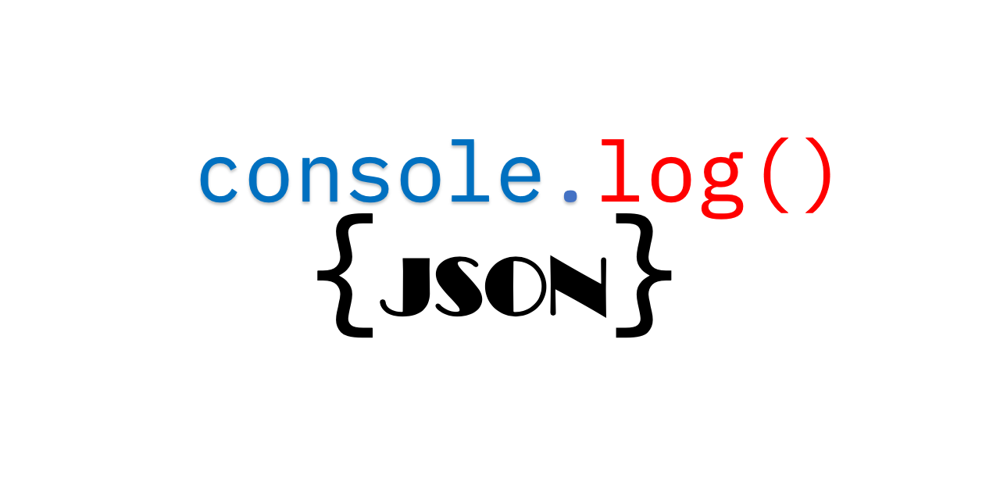
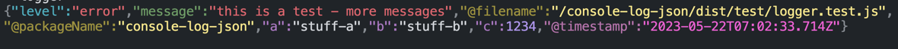

# console-log-json

<!-- markdownlint-disable -->

<!--suppress HtmlDeprecatedAttribute -->

<!-- ALL-CONTRIBUTORS-BADGE:START - Do not remove or modify this section -->
[](#contributors-)
<!-- ALL-CONTRIBUTORS-BADGE:END -->

<a href="https://www.npmjs.com/package/console-log-json"></a>

**Drop-in structured JSON logging for Node.js and the browser. Zero dependencies. One line to set up.**

Replace `console.log()` with production-grade JSON output -- no code changes required across your entire codebase.

```js
import { LoggerAdaptToConsole } from "console-log-json";
LoggerAdaptToConsole();

// Every console.log, console.error, console.warn, etc. now outputs structured JSON
console.log("user signed in", { userId: 42, plan: "pro" });
```

```json
{"level":"info","message":"user signed in","plan":"pro","userId":42,"@timestamp":"2025-01-15T08:30:00.000Z","@filename":"src/auth/login.ts","@packageName":"my-app"}
```

---

## Why console-log-json?

| | console-log-json | winston / pino / bunyan |
|---|---|---|
| **Setup** | 1 line, drop-in | Rewrite every log call |
| **Dependencies** | Zero | 5-30+ transitive deps |
| **Browser support** | Yes | No (Node only) |
| **Argument handling** | Throw anything in any order | Strict API signatures |
| **Stack traces** | Automatic, single-line | Manual formatting |
| **Source file tracking** | Automatic `@filename` on every log | Not built-in |
| **Crash safety** | Logger errors never crash your app | Depends on config |

### Zero dependencies

No `winston`. No `pino`. No `bunyan`. No transitive dependency tree to audit, no supply chain risk, no version conflicts. The entire library is self-contained.

### Drop-in replacement -- no code changes needed

Call `LoggerAdaptToConsole()` once at startup. Every `console.log()`, `console.error()`, `console.warn()`, `console.info()`, `console.debug()` across your entire codebase -- including third-party libraries -- instantly outputs structured JSON. No find-and-replace. No import changes.

### Throw anything at it

Strings, numbers, booleans, objects, errors, circular references, `null`, `undefined` -- in any order, in any combination. The logger figures it out and produces consistent, parseable JSON every time.

```js
console.log("request failed", 500, new Error("timeout"), { endpoint: "/api/users" }, null);
```

```json
{"level":"error","message":"request failed - 500  - timeout","endpoint":"/api/users","errCallStack":"Error: timeout\n    at ...","@timestamp":"..."}
```

### Single-line JSON for log ingestion

Every log entry is a single line of JSON. Stack traces, nested objects, multi-line error messages -- all flattened to one line. This is the format that log management tools like **DataDog**, **LogDNA**, **Splunk**, **OpenSearch**, **CloudWatch**, and **ELK** are designed to ingest. The output uses standard field names (`level`, `message`, `@timestamp`) that most tools recognize automatically or with minimal field mapping. No more multi-line log entries getting split into separate events or interleaved with other logs.

### Automatic metadata on every log

Every log entry automatically includes contextual information that would be tedious and error-prone to add manually:

- **`@timestamp`** -- ISO 8601 UTC timestamp. Essential for correlating events across services, tracking the order of operations during incident response, and querying logs by time range. Always in UTC so there's no timezone ambiguity across distributed systems.
- **`@filename`** -- the source file that generated the log. When you're paged at 3 AM and see an error in DataDog, this tells you exactly which file to open. No more grepping the codebase for a log message string.
- **`@logCallStack`** -- the full call stack at the point of logging. Shows you not just *where* the log was called, but *how the code got there*. Invaluable for tracing execution paths through middleware chains, event handlers, and deeply nested function calls.
- **`@packageName`** -- the npm package name from `package.json`. In monorepos or microservice architectures where multiple packages log to the same stream, this tells you which service or package produced the log without relying on container labels or deployment metadata.

No manual tagging. No `logger.info("msg", { file: __filename })`. It just works.

### Crash-safe by design

The logger will **never** crash your application. Every code path in the logging pipeline is wrapped in try/catch. If anything goes wrong during log formatting, the logger falls back silently. Your `console.log()` call will never throw an exception, even with the most exotic inputs.

### Browser compatible

Works in Node.js and in the browser. Node-specific features (file detection, `.env` loading) degrade gracefully -- `@filename` shows `<unknown>` in the browser instead of crashing. Ship the same logging code to your server and your frontend.

### Performance-conscious

- **One Error object** per log call (for stack capture), skipped entirely when stack features are disabled
- **Env vars cached** at init time, not read on every log call
- **Pre-compiled regex** for stack trace parsing
- **No JSON round-trip cloning** -- deep clone uses a visited-object map
- **No blocking I/O** in the logging hot path

---

## Quick Start

### Install

```bash
npm install console-log-json
```

### Initialize (one line)

```js
import { LoggerAdaptToConsole } from "console-log-json";
LoggerAdaptToConsole();
```

That's it. Every `console.log()` in your codebase now outputs JSON.

### Restore original console (optional)

```js
import { LoggerRestoreConsole } from "console-log-json";
LoggerRestoreConsole();
```

---

## Examples

### Basic message

```js
console.log("server started on port 3000");
```

```json
{"level":"info","message":"server started on port 3000","@timestamp":"2025-01-15T08:30:00.000Z","@filename":"src/index.ts","@packageName":"my-api"}
```

### Message with context

```js
console.log("order placed", { orderId: "ORD-123", total: 59.99, items: 3 });
```

```json
{"level":"info","message":"order placed","items":3,"orderId":"ORD-123","total":59.99,"@timestamp":"..."}
```

Context properties are extracted to the top level and sorted alphabetically for consistent, easy-to-parse output.

### Error with context

```js
console.log("payment failed", new Error("card declined"), { customerId: "C-456", amount: 99.99 });
```

```json
{"level":"error","message":"payment failed  - card declined","@errorObjectName":"Error","amount":99.99,"customerId":"C-456","errCallStack":"Error: card declined\n    at ...","@timestamp":"..."}
```

- Log level is automatically set to `error` when an Error object is present, even when using `console.log()`
- The error message is appended to your message string
- The full stack trace is included in `errCallStack`
- Context properties are merged in alongside

### ErrorWithContext for richer error handling

A common frustration in production debugging: you see `"connection refused"` in the logs but have no idea *which* query, *which* user, or *which* table caused it. `ErrorWithContext` solves this by letting you attach structured context to errors as they bubble up through your code, without losing the original stack trace.

```js
import { ErrorWithContext } from "console-log-json";

try {
  await db.query("SELECT * FROM users WHERE id = $1", [userId]);
} catch (err) {
  // Wrap the original error with additional context -- the original stack trace is preserved
  throw new ErrorWithContext(err, { userId, operation: "getUser", table: "users" });
}
```

```json
{"level":"error","message":"connection refused","operation":"getUser","table":"users","userId":42,"errCallStack":"Error: connection refused\n    at ...\nCaused By: Error: connection refused\n    at ...","@timestamp":"..."}
```

Now when you see this error in your log dashboard, you can immediately filter by `userId: 42` or `table: "users"` to understand the scope of the problem. You can nest multiple `ErrorWithContext` wrappings -- each layer adds context, and the full causal chain is preserved with `Caused By:` in the stack trace.

### Strings, numbers, booleans -- any order

```js
console.log("response", 200, "OK", { duration: 45 }, true);
```

```json
{"level":"info","message":"response - 200 - OK - true","duration":45,"@timestamp":"..."}
```

Strings, numbers, and booleans are concatenated into the message. Objects are extracted as top-level properties. The order you pass them doesn't matter.

### Multiple context objects are merged

```js
const userInfo = { firstName: "Homer", lastName: "Simpson" };
const requestInfo = { ip: "10.0.0.1", method: "POST" };
console.log("login attempt", userInfo, requestInfo);
```

```json
{"level":"info","message":"login attempt","firstName":"Homer","ip":"10.0.0.1","lastName":"Simpson","method":"POST","@timestamp":"..."}
```

### Circular references are handled safely

In real applications, objects with circular references are common -- Express request objects, Mongoose documents, socket instances, DOM nodes. Most loggers choke on these with `TypeError: Converting circular structure to JSON`. console-log-json handles them gracefully.

```js
const obj = { name: "test" };
obj.self = obj;
console.log("circular", obj);
```

```json
{"level":"info","message":"circular","name":"test","self":"[Circular ~]","@timestamp":"..."}
```

### Explicit log level override

Sometimes you want to use `console.log()` but control the log level -- for example, when a function dynamically decides the severity. Pass a `{ level: "..." }` object as any parameter.

```js
console.log({ level: "warn" }, "disk usage at 90%", { partition: "/dev/sda1" });
```

```json
{"level":"warn","message":"disk usage at 90%","partition":"/dev/sda1","@timestamp":"..."}
```

Supports `error`, `err`, `warn`, `warning`, `info`, `information`, `http`, `verbose`, `debug`, `silly`. Aliases like `err` and `warning` are normalized automatically.

### JSON string auto-parsing

Third-party libraries and APIs often emit pre-formatted JSON strings. Rather than logging these as opaque strings (making them impossible to filter or query on individual fields), console-log-json automatically detects JSON in your messages and extracts it into a structured `@autoParsedJson` property.

```js
console.log('{"event":"webhook","source":"stripe","type":"payment.succeeded"}');
```

```json
{"level":"info","message":"<auto-parsed-json-string-see-@autoParsedJson-property>","@autoParsedJson":{"event":"webhook","source":"stripe","type":"payment.succeeded"},"@timestamp":"..."}
```

Now you can query `@autoParsedJson.source = "stripe"` in your log dashboard instead of doing substring searches on a raw message. This can be disabled with `CONSOLE_LOG_JSON_DISABLE_AUTO_PARSE=true` if you prefer the raw string.

### Static properties on every log (service name, environment, etc.)

In microservice and containerized environments, SRE teams need to filter logs by service, environment, region, deployment version, or pod name. Rather than adding these to every log call, set them once at startup and they're automatically included on every line.

```js
LoggerAdaptToConsole({
  customOptions: {
    service: "payment-api",
    environment: "production",
    region: "us-east-1"
  }
});

console.log("health check passed");
```

```json
{"level":"info","message":"health check passed","environment":"production","region":"us-east-1","service":"payment-api","@timestamp":"..."}
```

Now every log from this service is filterable by `service: "payment-api"` in DataDog, OpenSearch, or any log aggregator -- without modifying a single log call across the codebase.

### Nesting context under a single key (clean top-level schema)

By default, properties from context objects are flattened to the top level of the JSON output. This is great for tools like LogDNA that only filter on top-level fields, but it can be a problem for teams using DataDog, OpenSearch, or Splunk -- "random" properties appearing at the top level can interfere with dashboards, alerts, and saved filters.

Set `CONSOLE_LOG_JSON_CONTEXT_KEY` to nest all user-provided context under a single, predictable key:

```bash
CONSOLE_LOG_JSON_CONTEXT_KEY=context
```

```js
console.log('order placed', { orderId: 'ORD-1', total: 59.99 }, { items: 3 });
```

**Without** the option (default -- flattened to top level):
```json
{"level":"info","message":"order placed","items":3,"orderId":"ORD-1","total":59.99,"@timestamp":"..."}
```

**With** `CONSOLE_LOG_JSON_CONTEXT_KEY=context`:
```json
{"level":"info","message":"order placed","context":{"items":3,"orderId":"ORD-1","total":59.99},"@timestamp":"..."}
```

Now the top level has a fixed, predictable schema: `level`, `message`, `context`, `@timestamp`, `@filename`, `@packageName`. Your DataDog filters and OpenSearch index mappings won't break when a developer adds a new context property. You can still query individual fields with `context.orderId` in tools that support nested field access.

The key name is configurable -- use `context`, `data`, `metadata`, or whatever fits your team's conventions.

### Log level filtering

Control log verbosity per environment. Set `warn` in production to keep logs lean, `debug` in staging for troubleshooting, `silly` in development to see everything. You can also change the level at runtime with `SetLogLevel()` -- useful for temporarily increasing verbosity on a live service during an incident without redeploying.

```js
LoggerAdaptToConsole({ logLevel: LOG_LEVEL.warn });

console.info("this will be suppressed");   // not logged
console.warn("this will appear");           // logged
console.error("this will appear too");      // logged
```

Log levels follow RFC 5424 priority (highest to lowest): `error` > `warn` > `info` > `http` > `verbose` > `debug` > `silly`.

### Colorized output for local development

Set the environment variable:
```bash
CONSOLE_LOG_COLORIZE=true
```



---

## All Console Methods Supported

| Method | Default Level |
|---|---|
| `console.error()` | error |
| `console.warn()` | warn |
| `console.info()` | info |
| `console.log()` | info |
| `console.http()` | http |
| `console.verbose()` | verbose |
| `console.debug()` | debug |
| `console.silly()` | silly |

---

## Environment Variable Configuration

All configuration is through environment variables. Set them before calling `LoggerAdaptToConsole()`, or in your `.env` file. This means you can change logging behavior per environment (dev vs. staging vs. production) without touching code.

### Output formatting

| Variable | Default | Effect |
|---|---|---|
| `CONSOLE_LOG_COLORIZE=true` | `false` | Enable ANSI-colored JSON output. **Turn this on for local development** -- it makes JSON logs much easier to scan in a terminal. Leave it off in production because log ingestion services (LogDNA, DataDog, CloudWatch) don't render ANSI codes and they add noise to stored logs. |
| `CONSOLE_LOG_JSON_NO_NEW_LINE_CHARACTERS=true` | `false` | Remove all `\n` characters from the log output, including in stack traces. **Turn this on** if your log aggregator splits on newlines and you're seeing stack traces show up as separate log events. The trade-off is that stack traces become harder to read in raw form. |
| `CONSOLE_LOG_JSON_NO_NEW_LINE_CHARACTERS_EXCEPT_STACK=true` | `false` | A middle ground -- removes newlines from the log envelope but keeps them inside stack traces. Useful when your log tool handles multi-line values within a JSON field but splits on newlines between entries. |

### Controlling metadata fields

These let you reduce log volume and noise. In high-throughput production systems, every byte counts -- stripping fields you don't query on can meaningfully reduce storage costs and improve log search performance.

| Variable | Default | Effect |
|---|---|---|
| `CONSOLE_LOG_JSON_NO_FILE_NAME=true` | `false` | Omit `@filename`. Turn this on if you don't need source file tracking -- for example, in a small service where the package name alone is enough context, or in the browser where it shows `<unknown>` anyway. |
| `CONSOLE_LOG_JSON_NO_PACKAGE_NAME=true` | `false` | Omit `@packageName`. Turn this on in single-package projects where the package name is redundant -- every log comes from the same service. |
| `CONSOLE_LOG_JSON_NO_TIME_STAMP=true` | `false` | Omit `@timestamp`. Turn this on only if your log transport adds its own timestamp (e.g., CloudWatch automatically timestamps every log entry). Avoids duplicate timestamp fields. |
| `CONSOLE_LOG_JSON_NO_STACK_FOR_NON_ERROR=true` | `false` | Omit `@logCallStack` for non-error logs. **This is the single most impactful option for reducing log size.** Call stacks on every `console.log("user signed in")` are rarely useful -- you typically only need them when debugging errors. Turning this on also improves performance (see below). |
| `CONSOLE_LOG_JSON_NO_LOGGER_DEBUG=true` | `false` | Omit `_loggerDebug`. This field is only present when `debugString: true` is passed to `LoggerAdaptToConsole()` and is used for debugging the logger itself. Most users will never see this field. |

### Message handling

| Variable | Default | Effect |
|---|---|---|
| `CONSOLE_LOG_JSON_DISABLE_AUTO_PARSE=true` | `false` | Disable automatic JSON parsing of log messages. By default, if you `console.log('{"event":"click"}')`, the logger detects it's JSON and extracts it into `@autoParsedJson` for structured querying. Turn this on if you want JSON strings to stay as plain strings in the `message` field -- for example, if you're logging raw API responses and don't want them restructured. |

### Context nesting

| Variable | Default | Effect |
|---|---|---|
| `CONSOLE_LOG_JSON_CONTEXT_KEY="context"` | *(empty)* | When set, all user-provided context object properties are nested under this key instead of being flattened to the top level. This gives your log output a fixed, predictable top-level schema — no "random" properties appearing at the top level that could break DataDog filters, OpenSearch index mappings, or Splunk field extractions. The key name is whatever you set: `context`, `data`, `metadata`, etc. When not set, the default behavior (flatten to top level) is preserved. See the [context key example](#nesting-context-under-a-single-key-clean-top-level-schema) above. |

### Performance tip

Setting both `CONSOLE_LOG_JSON_NO_FILE_NAME=true` and `CONSOLE_LOG_JSON_NO_STACK_FOR_NON_ERROR=true` skips stack trace capture entirely for non-error logs. This eliminates the most expensive operation in the logging pipeline (creating an Error object to capture the stack), reducing per-log overhead to near-zero. **Recommended for high-throughput production services** where you're logging hundreds or thousands of events per second and don't need source file tracking on every info/debug log. Error logs always capture the full stack regardless of these settings.

---

## API Reference

### `LoggerAdaptToConsole(options?)`

Initialize the logger. Call once at application startup.

```ts
LoggerAdaptToConsole({
  logLevel?: LOG_LEVEL,      // Minimum log level (default: LOG_LEVEL.info)
  debugString?: boolean,     // Include raw debug string in output (default: false)
  customOptions?: object     // Static key-value pairs added to every log entry
});
```

### `LoggerRestoreConsole()`

Restore original `console` methods. Useful for testing.

### `GetLogLevel()` / `SetLogLevel(level)`

Read or change the current log level at runtime.

### `NativeConsoleLog(...args)`

Call the original `console.log()` bypassing JSON formatting. Useful for debugging the logger itself.

### `ErrorWithContext`

```ts
import { ErrorWithContext } from "console-log-json";

// Wrap a string
throw new ErrorWithContext("something broke", { userId: 42 });

// Wrap an existing error with additional context
throw new ErrorWithContext(existingError, { retryCount: 3, endpoint: "/api" });

// Nest multiple levels -- full causal chain is preserved
throw new ErrorWithContext(
  new ErrorWithContext(originalError, { innerContext: "value" }),
  { outerContext: "value" }
);
```

### `LOG_LEVEL` enum

```ts
import { LOG_LEVEL } from "console-log-json";

// LOG_LEVEL.error   (priority 0 -- highest)
// LOG_LEVEL.warn    (priority 1)
// LOG_LEVEL.info    (priority 2)
// LOG_LEVEL.http    (priority 3)
// LOG_LEVEL.verbose (priority 4)
// LOG_LEVEL.debug   (priority 5)
// LOG_LEVEL.silly   (priority 6 -- lowest)
```

---

## Browser Usage

```js
import { LoggerAdaptToConsole } from "console-log-json";
LoggerAdaptToConsole();

// Works the same as Node.js
console.log("button clicked", { component: "Header", action: "menu-toggle" });
```

In the browser:
- `@filename` shows `<unknown>` (no filesystem access)
- `@packageName` is empty (no `package.json`)
- `.env` loading is skipped
- Stack traces use the browser's native format (source maps work automatically)
- Output goes to the browser's `console.log` (visible in DevTools)

The `browser` field in `package.json` tells bundlers (webpack, vite, etc.) to stub out Node-specific modules automatically.

---

## Contributors

<!-- ALL-CONTRIBUTORS-LIST:START - Do not remove or modify this section -->
<!-- prettier-ignore-start -->
<!-- markdownlint-disable -->
<table>
  <tbody>
    <tr>
      <td align="center" valign="top" width="14.28%"><a href="https://github.com/Logan-seongjae"><br /><sub><b>Logan.seongjae(Benefit)</b></sub></a><br /><a href="https://github.com/hiro5id/console-log-json/commits?author=Logan-seongjae" title="Code">💻</a></td>
      <td align="center" valign="top" width="14.28%"><a href="https://github.com/hiro5id"><br /><sub><b>Roberto Sebestyen</b></sub></a><br /><a href="https://github.com/hiro5id/console-log-json/commits?author=hiro5id" title="Code">💻</a> <a href="https://github.com/hiro5id/console-log-json/commits?author=hiro5id" title="Documentation">📖</a> <a href="#projectManagement-hiro5id" title="Project Management">📆</a> <a href="#security-hiro5id" title="Security">🛡️</a> <a href="https://github.com/hiro5id/console-log-json/pulls?q=is%3Apr+reviewed-by%3Ahiro5id" title="Reviewed Pull Requests">👀</a></td>
      <td align="center" valign="top" width="14.28%"><a href="https://github.com/igordreher"><br /><sub><b>Igor Dreher</b></sub></a><br /><a href="https://github.com/hiro5id/console-log-json/commits?author=igordreher" title="Code">💻</a></td>
      <td align="center" valign="top" width="14.28%"><a href="https://github.com/WesSparla"><br /><sub><b>WesSparla</b></sub></a><br /><a href="https://github.com/hiro5id/console-log-json/commits?author=WesSparla" title="Documentation">📖</a> <a href="https://github.com/hiro5id/console-log-json/commits?author=WesSparla" title="Tests">⚠️</a></td>
      <td align="center" valign="top" width="14.28%"><a href="https://github.com/rkristelijn"><br /><sub><b>Remi Kristelijn</b></sub></a><br /><a href="https://github.com/hiro5id/console-log-json/commits?author=rkristelijn" title="Code">💻</a></td>
    </tr>
  </tbody>
</table>

<!-- markdownlint-restore -->
<!-- prettier-ignore-end -->

<!-- ALL-CONTRIBUTORS-LIST:END -->

* *[Adding Contributors...](docs/CONTRIBUTING.md)*

## License

MIT
